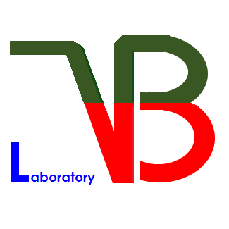

# Hello, I'm Minji Kim from VBlab!  
  
## Master's degree in Information Convergence Engineering(AI major) from Pusan National University

### Publications(All 1st Author)
-	Min-ji Kim, QiKang Deng, DongWon Choo, Hyo Chul Ji and DoHoon Lee “AGCNet: Enhancing High-contrast Images with Automatic Gamma Correction,” The 19th International Conference on Multimedia Information Technology and Applications (MITA) July, 2023. Ostrava, Czech.
-	Min-Ji Kim and DoHoon Lee, "A Study on the Trustworthiness Evaluation of AI Model for Discrimination of Fireblight," Journal of Korea Multimedia Society, vol. 26, no. 2, pp. 420-428, 2023
-	Min-Ji Kim, Sang-Un Park, Hwan-Gue Cho, and DoHoon Lee, "Analysis on Characteristics of Source Codes in Web-based Coding Assignment Managing System," in 한국정보과학회 학술발표논문집, 2022, pp. 1262-1264.
-	Min-Ji Kim, Seung Kyu Kim, DoHoon Lee, and Jin Kyu Gahm, "Comparative Study of Deep Learning Model for Semantic Segmentation of Water System in SAR Images of KOMPSAT-5," Journal of Korea Multimedia Society, vol. 25, no. 2, pp. 206-214, 2022.
-	Min-Ji Kim, Sang-Un Park, In-Gu Jo, Dong-Yeop Ra, DoHoon Lee, and Hwan-Gue Cho, "A Study on Difficulty Rating Method using Web-based Coding Evaluation System," in 한국컴퓨터교육학회 학술발표대회논문집, 2022, pp. 259-262.

### Awards
- The 19th International Conference on Multimedia Information Technology and Applications (MITA 2023) BEST PAPER AWARD

**Vision & Biometric Lab. (Prof. DoHoon Lee): 2021. 9. - Current**
---
 
**Programming Language: C/C++, Python** 
**Exposure to PyTorch, OpenCV, Tensorflow**
- 🤓 **I’m currently learning** Exposure Correction, Low-light Enhancement 
- 🔭 **I’m currently working on**  Research in Exposure Correction in High-resolution Images(FHD or higher).
<!--
- 📫 **How to reach me** [LinkedIn](https://www.linkedin.com/in/jinmo-kim-3041501aa), [Site](https://jinmo.kim)
-->

<!--
**JinmoKIM1012/JinmoKIM1012** is a ✨ _special_ ✨ repository because its `README.md` (this file) appears on your GitHub profile.

Here are some ideas to get you started:

- 🔭 I’m currently working on ...
- 🌱 I’m currently learning ...
- 👯 I’m looking to collaborate on ...
- 🤔 I’m looking for help with ...
- 💬 Ask me about ...
- 📫 How to reach me: ...
- 😄 Pronouns: ...
- ⚡ Fun fact: ...
-->

<!--
**MinjiKimMJ/MinjiKimMJ** is a ✨ _special_ ✨ repository because its `README.md` (this file) appears on your GitHub profile.

Here are some ideas to get you started:

- 🔭 I’m currently working on ...
- 🌱 I’m currently learning ...
- 👯 I’m looking to collaborate on ...
- 🤔 I’m looking for help with ...
- 💬 Ask me about ...
- 📫 How to reach me: ...
- 😄 Pronouns: ...
- ⚡ Fun fact: ...
-->
